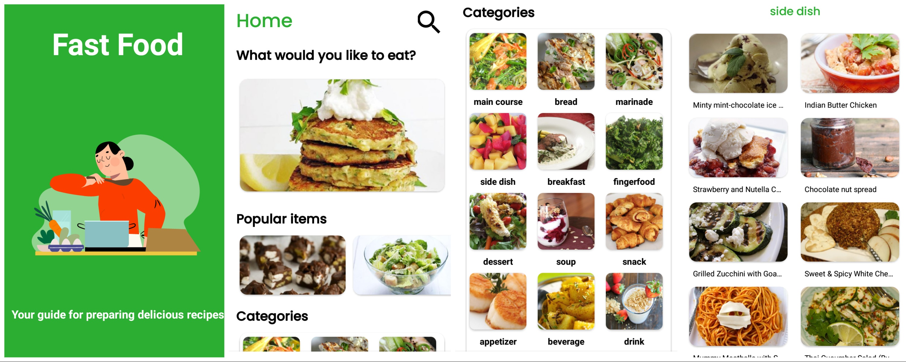
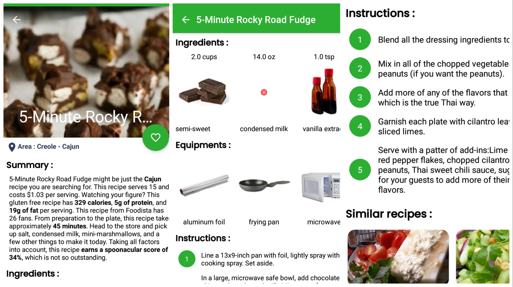
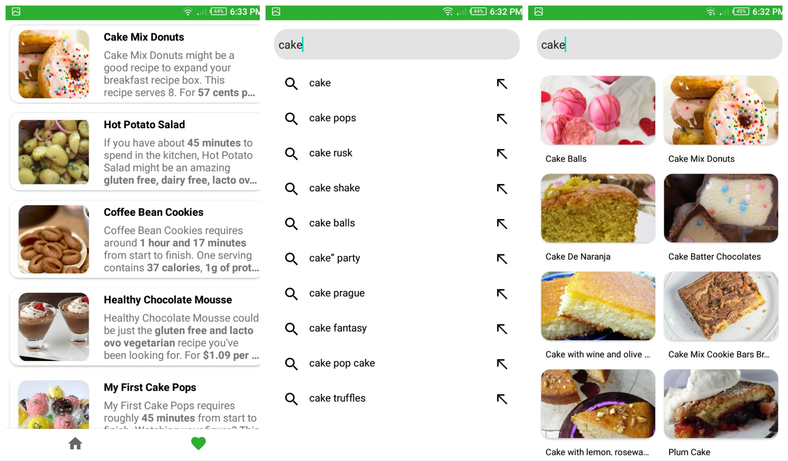

# Fast_Food!

It’s a Recipe app has a lot of recipes from spoonacular API with many features.

I used mvvm design pattern, navigation component, room database to store
favorite recipes and also store the last loaded results to increase the performance
specially when there is no connection, kotlin coroutines, Rx java.

here are some screenshots of the app

[click here to see a video for the app](https://www.linkedin.com/posts/abdelmohaymn-elbashier-4146b0235_coding-project-android-activity-7079541242371448832-cOx5?utm_source=share&utm_medium=member_desktop)

